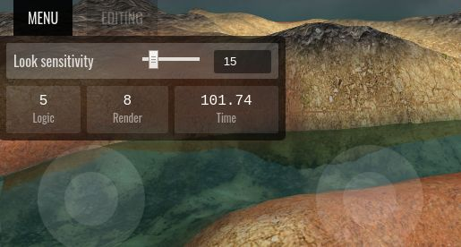
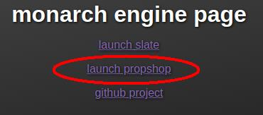

# First development update

so, we're working towards a gameplay alpha for our game [nanoshooter](https://nanoshooter.monarch-games.com)

we're intending to post an update on this devblog once a week

as a general rule, we're trying to focus mostly on describing things that we've completed since the last update, instead of babbling about what we're planning to do in the future

of course there is no last update, so here's what i've done in recent weeks

## 2d overlay interface

- i recently made this menu system

- it's built using preact components and mobx for state management

- main menu has
	- look sensitivity setting, saves to localStorage (it remembers)
	- basic performance statistics, logic and render rates, time elapsed

- editor menu has
	- tool selection, currently only add/select tools
	- the tools don't do anything yet, except they project a laser pointer
		at the center of the screen for the editor

- the mobile thumbsticks were also reworked to be a part of this new overlay system

- nice framerate eh? don't worry, it's just my virtual machine with no beef

## Early work on the "propshop"

- the engine has been split into two different modes
	- the "slate" — (as in "blank slate") is an almost-empty scene to experiment on engine features before testing them in a game like nanoshooter
	- the "propshop" — this will become the place we edit and prepare props for importation into the game world (placing collision boxes, editor snap points, etc)

- right now the propshop **is entirely empty**  
	there's literally nothing to see or do at the moment

## Created monarch-games.com

- simple website
- engine and nanoshooter are now hosted on subdomains
	- [engine.monarch-games.com](https://engine.monarch-games.com)
	- [nanoshooter.monarch-games.com](https://nanoshooter.monarch-games.com)
- launched the [devblog](../../../../)
	- this is the second post
	- see my first post ["gamers deserve better"](../../16.1/gamers-deserve-better)
